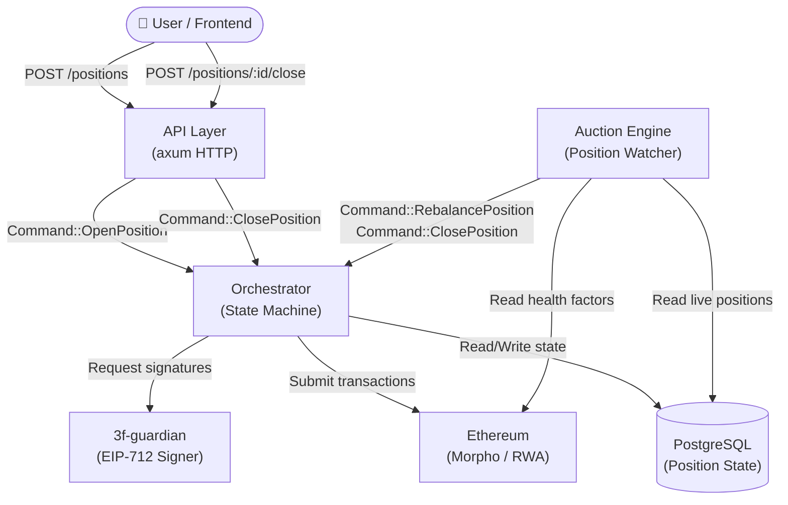
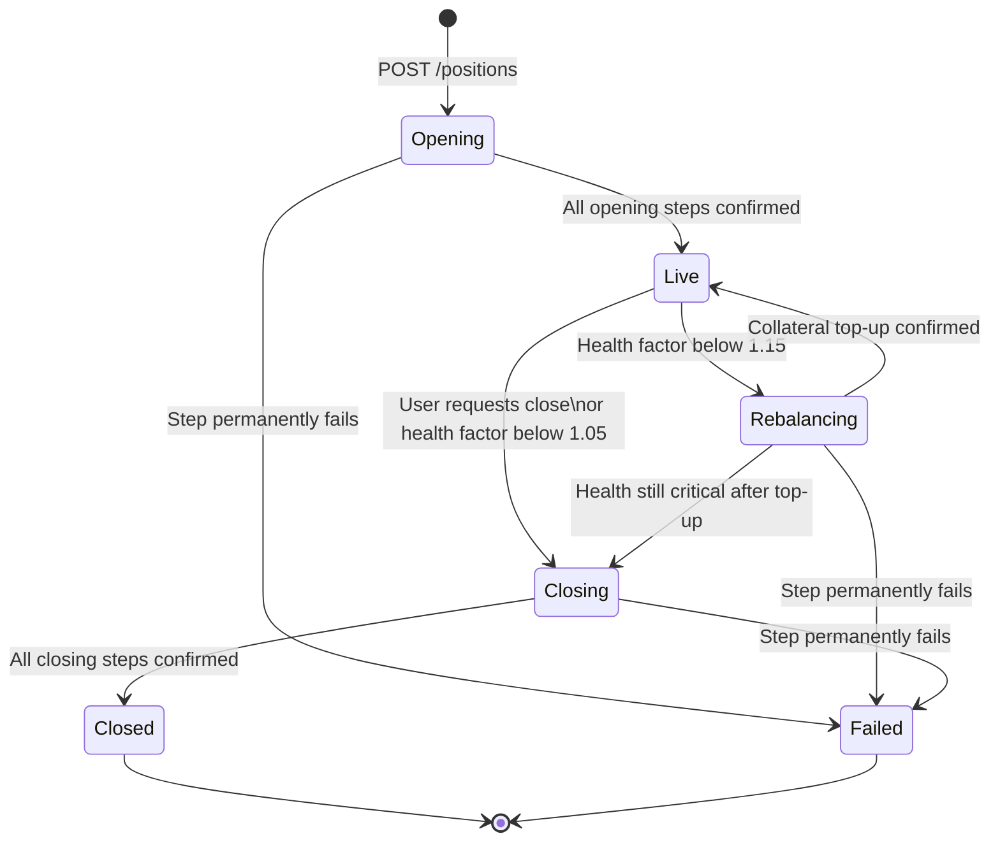
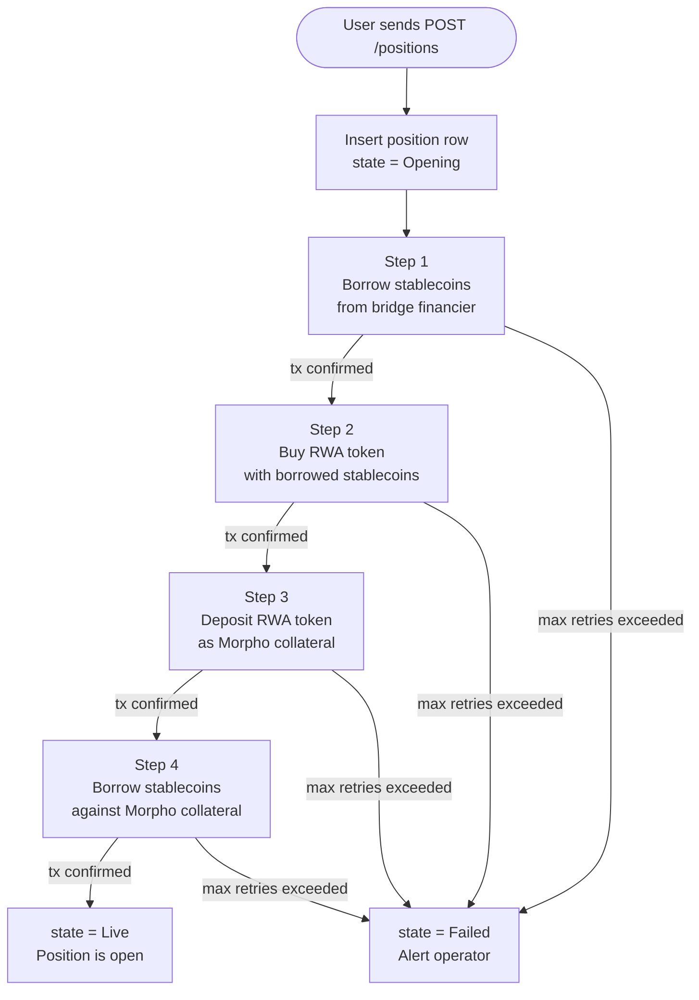
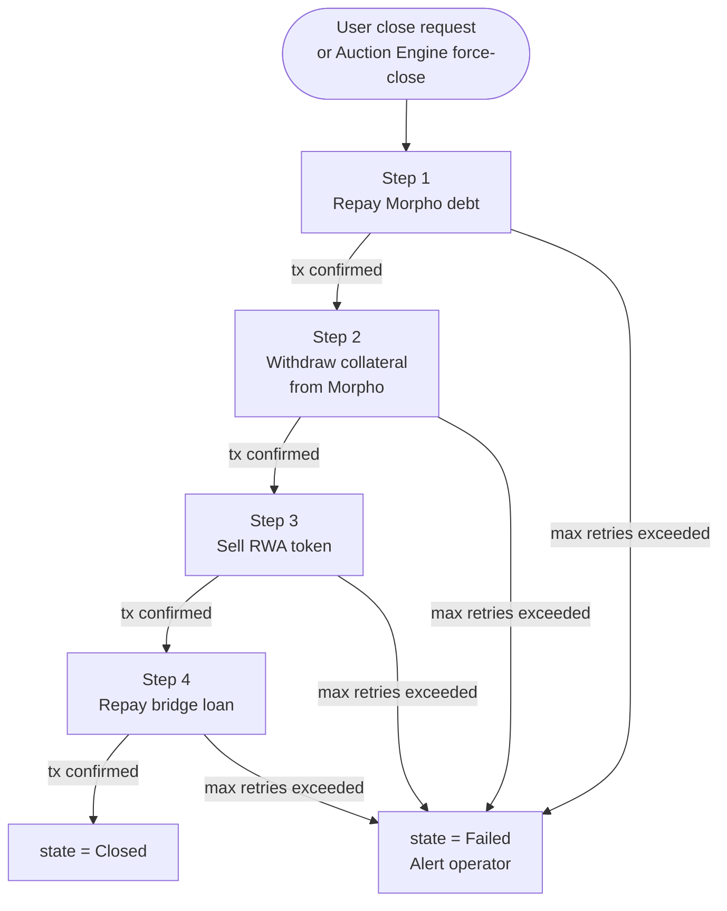
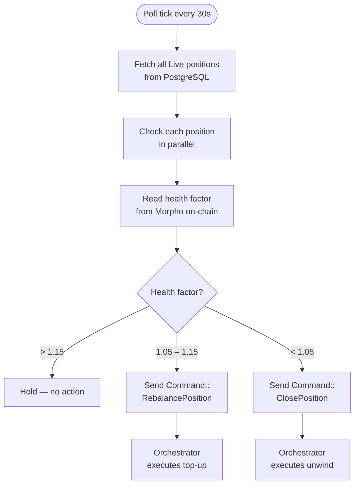
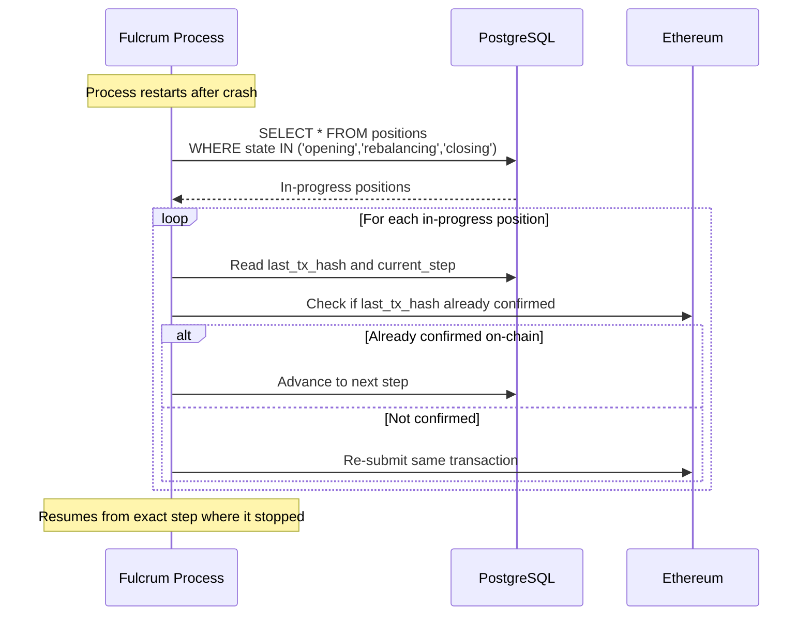

# Fulcrum

Fulcrum is an experimental Rust backend for managing leveraged positions on tokenized real-world assets (RWAs). It coordinates multi-step on-chain settlement workflows across bridge financing, Morpho collateral, and stablecoin borrowing — and continuously monitors open positions to protect them from liquidation.

The name comes from physics: a **fulcrum** is the pivot point of a lever. This service is the pivot point between user intent and on-chain leverage.

---

## What it does

A leveraged RWA position is not a single transaction. It is a sequence of steps:

1. Borrow stablecoins from a bridge financier
2. Use those stablecoins to acquire an RWA token (e.g. a Centrifuge pool token)
3. Deposit the RWA token as collateral on Morpho
4. Borrow more stablecoins against that collateral
5. Monitor the position's health factor continuously
6. Rebalance (add collateral) if health drops toward the liquidation threshold
7. Unwind (repay debt → withdraw collateral → sell RWA → repay bridge) on close or emergency

Fulcrum manages the full lifecycle: opening, monitoring, rebalancing, and closing.

---

## Architecture

### System overview



---

### Position lifecycle



---

### Opening workflow



---

### Closing workflow



---

### Auction engine decision loop



---

### Crash recovery



---

## Project structure

```
fulcrum/
├── crates/
│   ├── common/          # Shared types, errors, config
│   │   ├── types.rs     # Position, PositionState, Command, WorkflowStep
│   │   ├── error.rs     # EngineError (retryable vs fatal)
│   │   └── config.rs    # AppConfig loaded from environment
│   │
│   ├── db/              # PostgreSQL layer
│   │   ├── pool.rs      # Connection pool + auto-migrations
│   │   └── queries.rs   # All queries (optimistic concurrency, audit trail)
│   │
│   ├── chain/           # Ethereum client
│   │   ├── client.rs    # ChainClient trait + JSON-RPC implementation
│   │   └── morpho.rs    # Morpho health factor reads (alloy ABI)
│   │
│   ├── orchestrator/    # State machine + step executor
│   │   ├── machine.rs   # State transitions (atomic with audit event)
│   │   ├── worker.rs    # Tokio task, per-position locking, retry logic
│   │   └── steps/       # One file per workflow step
│   │
│   ├── auction_engine/  # Position watcher
│   │   ├── watcher.rs   # Poll loop (SKIP LOCKED, parallel checks)
│   │   └── decisions.rs # Pure decision logic (unit tested)
│   │
│   └── api/             # HTTP server
│       ├── main.rs      # Entrypoint: wires all services + graceful shutdown
│       ├── routes/      # positions.rs, health.rs
│       └── lib.rs       # Router + Bearer auth middleware
│
├── migrations/
│   ├── ...001_create_positions.sql
│   └── ...002_create_workflow_events.sql
│
└── .env.example
```

---

## Stack

| Layer | Technology |
|---|---|
| Language | Rust 1.94+ |
| Async runtime | Tokio |
| HTTP framework | Axum |
| Database | PostgreSQL via sqlx |
| Ethereum / ABI | Alloy |
| Structured logging | Tracing + JSON output |
| Configuration | Environment variables |

---

## Getting started

**Prerequisites:** Rust, PostgreSQL, an Ethereum RPC endpoint.

```bash
# 1. Clone and enter
cd fulcrum

# 2. Configure
cp .env.example .env
# Edit .env — set DATABASE__URL, CHAIN__RPC_URL, API__API_KEY

# 3. Create the database
createdb fulcrum

# 4. Build and run (migrations apply automatically on startup)
cargo run

# 5. Open a position
curl -X POST http://localhost:8080/v1/positions \
  -H "Authorization: Bearer <your-api-key>" \
  -H "Content-Type: application/json" \
  -d '{
    "owner_address":      "0xYourWallet",
    "rwa_token":          "0xCentrifugePoolToken",
    "facility":           "0xMorphoMarket",
    "market_id":          "0xMarketId32Bytes",
    "target_leverage":    "2.5",
    "initial_collateral": "1000000000000000000"
  }'

# 6. Poll for status
curl http://localhost:8080/v1/positions/<id> \
  -H "Authorization: Bearer <your-api-key>"
```

---

## API endpoints

| Method | Path | Description |
|---|---|---|
| `POST` | `/v1/positions` | Open a new leveraged position (202 Accepted — async) |
| `GET` | `/v1/positions?owner=0x...` | List positions for an owner |
| `GET` | `/v1/positions/:id` | Get position state and financial snapshot |
| `POST` | `/v1/positions/:id/close` | Request a manual close (202 Accepted — async) |
| `GET` | `/health` | Liveness check (includes DB connectivity) |

---

## Production safety properties

**No double-processing** — a per-position `tokio::Mutex` inside the orchestrator prevents two concurrent workflows from running on the same position, even under high command throughput.

**Crash recovery** — every step is checkpointed to PostgreSQL *before* any on-chain transaction is submitted. On restart, all in-progress positions are re-queued and resume from the last completed step.

**Optimistic concurrency** — every position UPDATE includes `AND version = $old_version`. Zero rows affected means a concurrent writer modified the row first; the operation returns `ConcurrentModification` and the caller retries.

**Exponential back-off** — transient step failures (RPC errors, timeouts) are retried with exponential back-off up to `ENGINE__MAX_STEP_RETRIES`. Fatal failures (transaction reverted, insufficient liquidity) skip retries and mark the position `Failed` immediately.

**Audit trail** — every state transition and step event is written to `workflow_events` in the same database transaction as the state change. The table is append-only and never updated.

---

## What needs wiring before mainnet

| Component | File | What to do |
|---|---|---|
| Transaction signer | `chain/src/client.rs` → `send_transaction` | Wire in your KMS, HSM, or local `LocalSigner` from alloy |
| Calldata encoders | `orchestrator/src/steps/*.rs` → `encode_*` functions | Encode real Morpho / bridge ABIs using alloy `sol!` macro |
| Guardian URL | `.env` → `CHAIN__GUARDIAN_URL` | Point at your running `3f-guardian` instance |

---

## License

MIT
